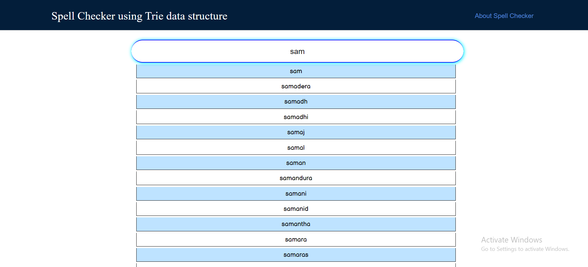

# Spell Cheker
This projects implements the Trie Data Structure which develops an autocomplete feature or suggestion.

## Table of contents

  - [Overview](#overview)
  - [The challenge](#the-challenge)
  - [Basic Implementation](#implementation)
  - [Screenshot](#screenshot)
  - [What I learned](#what-i-learned)
  

### Overview
  Trie is a tree-based data structure, which is used for efficient retrieval of a key in a large dataset of strings. 

  Trie is an efficient information retrieval data structure. Using Trie, search complexities can be brought to optimal limit O(M) 
  (Where M is the maximum string length).

- Live Demo:👇

- [x] [auto-complete-feature.vercel.app/](https://auto-complete-feature.vercel.app/)

### The challenge

Users should be able to:

- Enter a word or partial word
- Recieve a list of words whose names start with the substring that they enter in the search bar

### Implementation

### Screenshot

### What I learned

I learned about the Trie data structure and how it works and it's application. 

